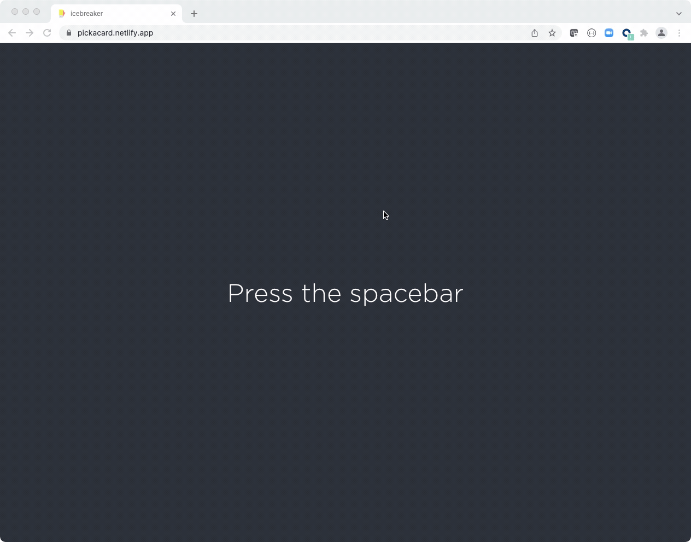
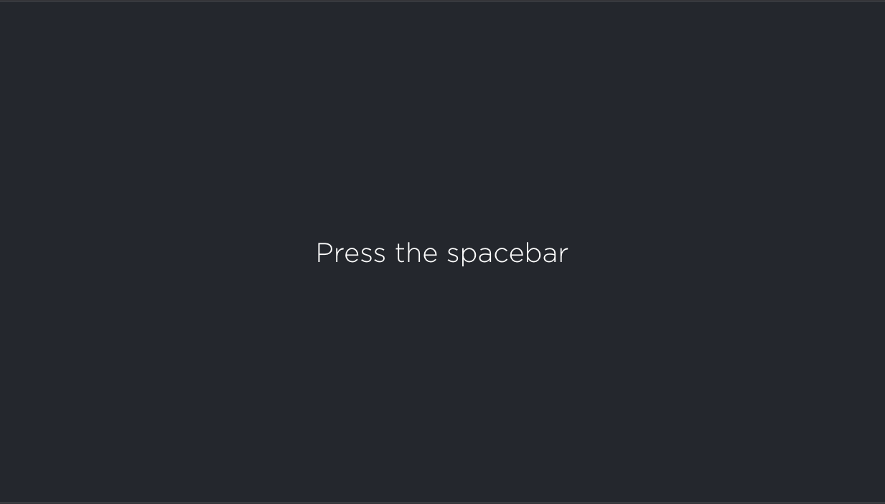
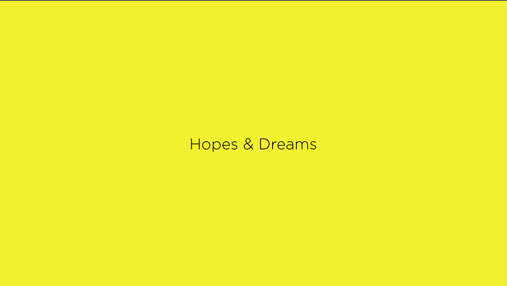
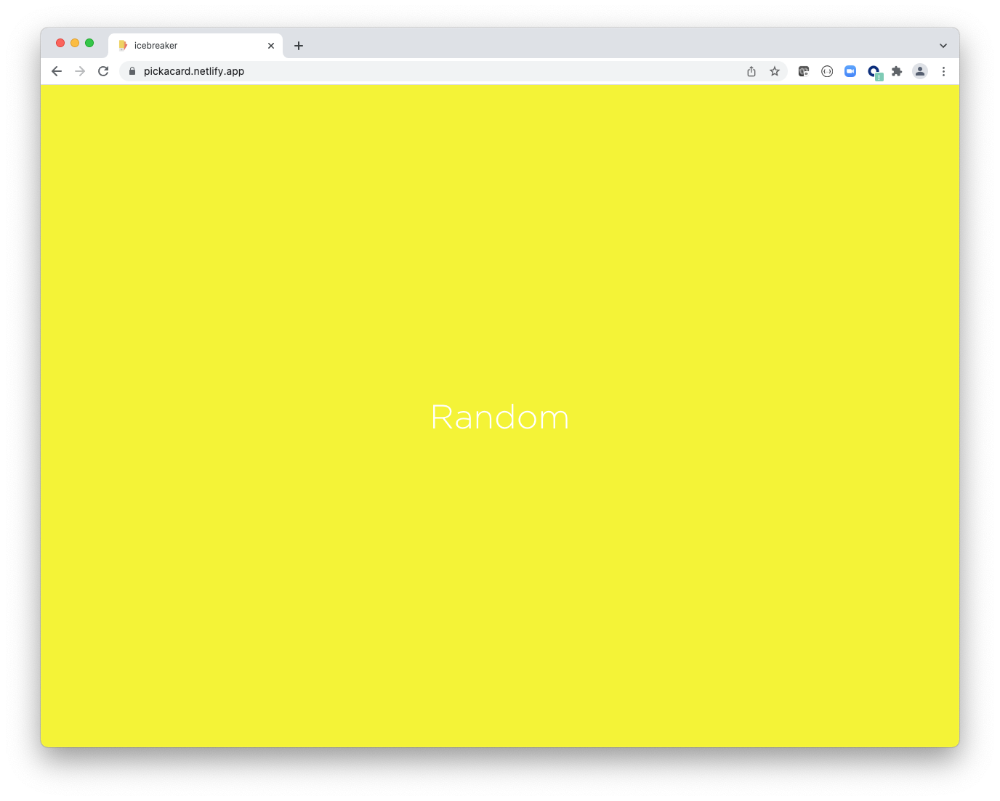
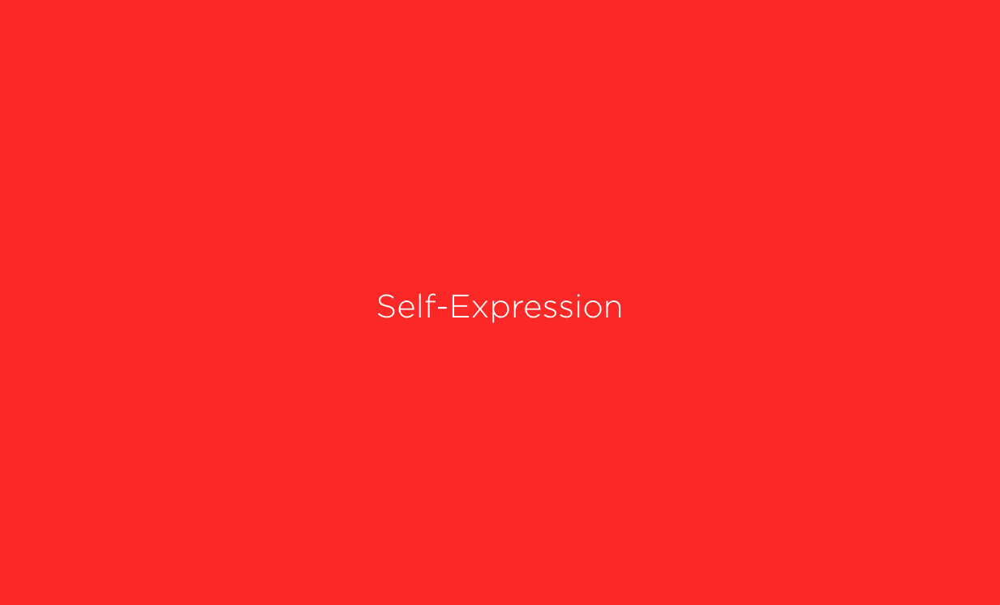
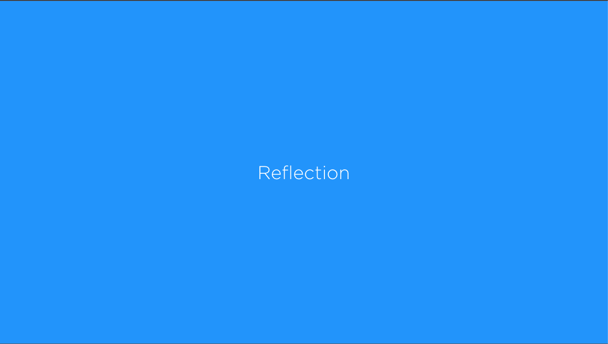
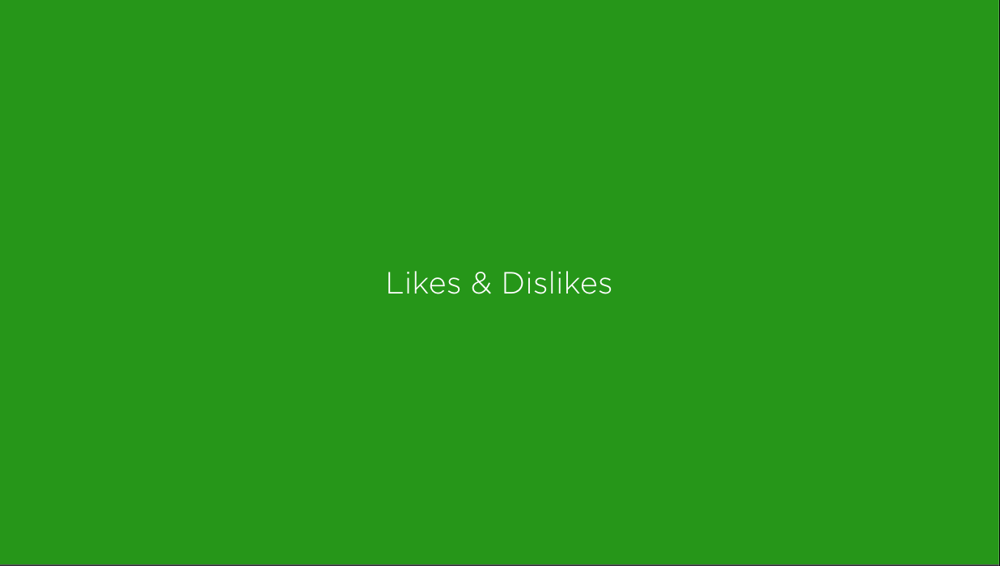

  

## Icebreaker

A deck of 150 conversation prompts that spark meaningful discussions and strengthen relationships. With the Little Talk Deck, you’ll:

- Move beyond small talk
- Encourage self-expression
- Inspire personal development
- Cultivate self-acceptance and self-truth
- Break down barriers, cultivate connections, and cultivate openness and vulnerability
- Get to know people better across 6 categories: hopes & dreams, random, self-expression, reflection, likes & dislikes, and emotional intelligence

Perfect to use with friends, coworkers, family, and strangers. Select a card and start sharing.
Available for purchase [here](https://bestself.co/products/little-talk-deck).

## Motivation

If, like me, you sometimes struggle to pick a category then this little random category generator build in React has got you covered. It’s super simple. Hit up the site, Press the spacebar and lean in. 

The app is running [here](https://cards-littletalk.netlify.app/). Check it out the for youself. Enjoy!

## Card Categories

---

## Available Scripts

In the project directory, you can run:

### `npm start`

Runs the app in the development mode.\
Open [http://localhost:3000](http://localhost:3000) to view it in the browser.

The page will reload if you make edits.\
You will also see any lint errors in the console.

### `npm test`

Launches the test runner in the interactive watch mode.\
See the section about [running tests](https://facebook.github.io/create-react-app/docs/running-tests) for more information.

### `npm run build`

Builds the app for production to the `build` folder.\
It correctly bundles React in production mode and optimizes the build for the best performance.

The build is minified and the filenames include the hashes.\
Your app is ready to be deployed!

See the section about [deployment](https://facebook.github.io/create-react-app/docs/deployment) for more information.